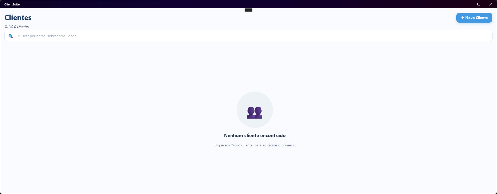
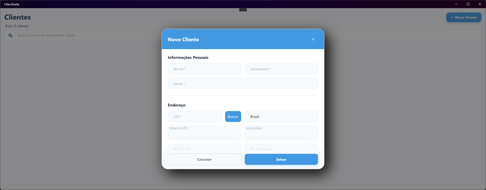
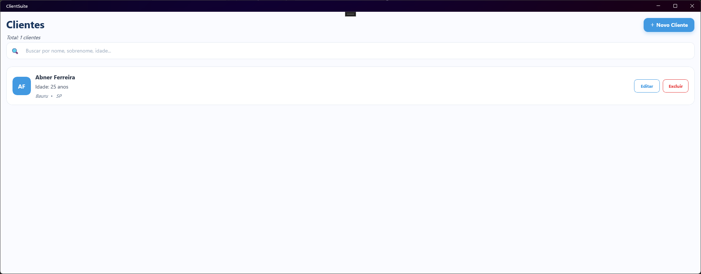
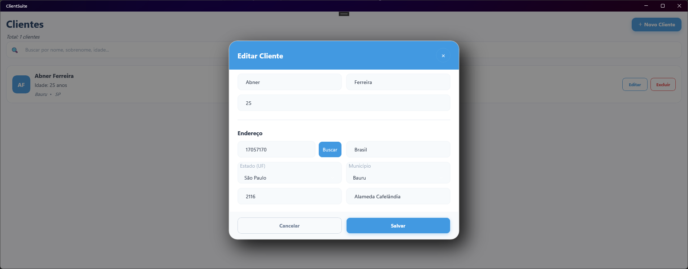
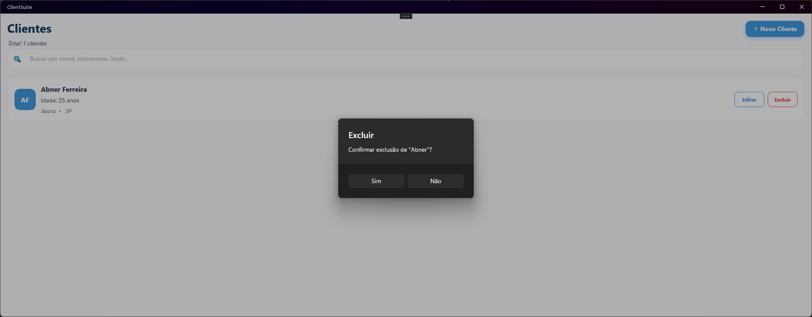

# ClientSuite — Cadastro de Clientes (MAUI)

Aplicativo de exemplo para gerenciamento de clientes com .NET MAUI.

Este README inclui um **tour visual** das telas principais (capturas abaixo).

## Recursos
- Listagem de clientes com busca.
- Criação e edição de clientes via modal.
- Busca de endereço por CEP (campo dedicado com botão **Buscar**).
- Confirmação para exclusão de registros.
- UI moderna com cards, sombras suaves e cores de realce.


## Capturas de tela

**Lista vazia**  


**Modal **Novo Cliente****  


**Lista com 1 cliente**  


**Modal **Editar Cliente****  


**Confirmação de exclusão**  


## Estrutura (sugerida)
```
/ (root do repositório)
├─ README.md
└─ screenshots/
   ├─ screen_01.png
   ├─ screen_02.png
   ├─ screen_03.png
   ├─ screen_04.png
   ├─ screen_05.png
   └─ screen_06.png
```

## Licença
Este projeto pode ser utilizado livremente para estudos e como base de referência. Ajuste a licença conforme sua necessidade.
